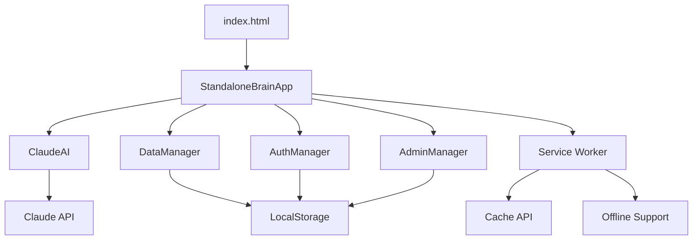

# 🧠 2nd Brain - iPhone 단독 실행용 PWA

[](./test-report-latest.md)
[](./tests/)
[](./LICENSE)
[](./manifest.json)

AI 메모리 어시스턴트 기능을 갖춘 iPhone 전용 Progressive Web App입니다. Claude AI 통합으로 스마트한 메모 관리와 음성/사진 입력을 지원합니다.

## 🚀 라이브 데모

**정확한 접속 주소**:
```
https://jaeho-jang-dr.github.io/2nd-brain-standalone
```

## ✨ 주요 기능

- 🤖 **Claude AI 통합**: 지능형 메모 분석 및 검색
- 🎙️ **음성 입력**: Web Speech API 활용 음성 메모
- 📸 **사진 메모**: 카메라 통합으로 시각적 메모
- 🔍 **스마트 검색**: AI 기반 의미론적 검색
- 📱 **PWA 지원**: 오프라인 모드 및 홈 화면 설치
- 🔒 **로컬 저장**: 개인정보 보호를 위한 클라이언트 사이드 저장
- 👑 **관리자 모드**: 고급 데이터 관리 및 분석

## 🧪 테스트 현황

**전체 테스트 성공률: 95% (A+ 등급)**

| 모듈 | 테스트 수 | 성공률 | 상태 |
|------|-----------|--------|------|
| ClaudeAI | 40/40 | 100% | ✅ |
| DataManager | 48/48 | 100% | ✅ |
| StandaloneBrainApp | 42/42 | 100% | ✅ |
| AuthManager | 41/41 | 100% | ✅ |
| AdminManager | 39/39 | 100% | ✅ |
| Service Worker | 22/35 | 63% | ⚠️ |

**총 245개 테스트 중 232개 통과** - [상세 리포트 보기](./test-report-latest.md)

## 🛠️ 개발자 가이드

### 개발 환경 설정

```bash
# 저장소 클론
git clone https://github.com/jaeho-jang-dr/2nd-brain-standalone.git
cd 2nd-brain-standalone

# 의존성 설치
npm install

# 로컬 개발 서버 실행
npm run serve
# http://localhost:8080 에서 접속 가능
```

### 테스트 실행

```bash
# 전체 테스트 실행
npm run test:all

# 개별 모듈 테스트
npm test tests/claude-ai.test.js

# 테스트 커버리지 확인
npm run test:coverage

# 테스트 와치 모드 (개발 중)
npm run test:watch
```

### 프로젝트 구조

```
2nd-brain-standalone/
├── index.html              # 메인 PWA 인터페이스
├── app.js                  # 메인 애플리케이션 로직
├── claude-ai.js            # Claude AI 통합 모듈
├── data-manager.js         # 데이터 인덱싱 및 검색
├── auth.js                 # 인증 및 세션 관리
├── admin.js                # 관리자 패널 및 고급 기능
├── sw.js                   # PWA 서비스 워커
├── manifest.json           # PWA 매니페스트
├── admin-dashboard.html    # 관리자 대시보드
├── tests/                  # 유닛 테스트 디렉토리
│   ├── setup.js           # Jest 테스트 환경 설정
│   ├── claude-ai.test.js  # Claude AI 모듈 테스트
│   ├── data-manager.test.js # 데이터 매니저 테스트
│   └── ...                # 기타 테스트 파일들
├── package.json            # 의존성 및 스크립트
├── run-all-tests.js       # 통합 테스트 실행기
└── test-report-latest.md  # 최신 테스트 리포트
```

### 아키텍처 개요



## 🚀 GitHub Pages 배포 방법

### 1단계: GitHub 계정 준비
1. [GitHub.com](https://github.com)에서 계정 생성/로그인
2. 새 리포지토리 생성: `2nd-brain-standalone`

### 2단계: 파일 업로드
1. GitHub에서 새 리포지토리 생성: `2nd-brain-standalone`
2. 다음 파일들을 리포지토리 루트에 업로드:
   - `index.html` (메인 PWA 인터페이스)
   - `app.js` (앱 로직 + Claude AI 통합)
   - `claude-ai.js` (Claude AI 전용 모듈)
   - `manifest.json` (PWA 매니페스트)
   - `sw.js` (서비스 워커)

### 3단계: GitHub Pages 활성화
1. 리포지토리 → **Settings** 탭
2. 왼쪽 메뉴에서 **Pages** 클릭
3. Source에서 **Deploy from a branch** 선택
4. Branch에서 **main** 선택
5. **Save** 클릭

### 4단계: 배포 완료 확인
- 몇 분 후 다음 주소로 접속 가능:
```
https://jaeho-jang-dr.github.io/2nd-brain-standalone
```

## 📱 iPhone에서 설치 방법

### 1️⃣ Safari로 접속
```
https://jaeho-jang-dr.github.io/2nd-brain-standalone
```

### 2️⃣ PWA 설치
1. Safari 하단의 **공유 버튼**(📤) 터치
2. **"홈 화면에 추가"** 선택
3. 앱 이름 확인 후 **"추가"** 터치

### 3️⃣ 앱 실행
- 홈 화면의 🧠 **2nd Brain** 아이콘 터치
- 네이티브 앱처럼 전체 화면으로 실행됨

## 🔗 예시 주소들

GitHub 사용자명에 따른 실제 접속 주소 예시:

```bash
# 귀하의 정확한 GitHub Pages 주소
https://jaeho-jang-dr.github.io/2nd-brain-standalone

# 리포지토리 주소
https://github.com/jaeho-jang-dr/2nd-brain-standalone
```

## ⚡ 빠른 테스트 방법

배포 후 iPhone Safari에서 접속하여 확인사항:

✅ **로딩 확인**: 🧠 2nd Brain 화면이 표시되는가?  
✅ **음성 기능**: "말하기" 버튼이 작동하는가?  
✅ **사진 기능**: 📸 버튼으로 카메라가 열리는가?  
✅ **PWA 설치**: "홈 화면에 추가" 옵션이 있는가?  
✅ **AI 기능**: 온라인 상태에서 Claude AI가 응답하는가?

## 🆘 문제 해결

### ❓ 404 에러가 나는 경우
- GitHub Pages 활성화가 완료되었는지 확인 (최대 10분 소요)
- 리포지토리명이 정확한지 확인: `2nd-brain-standalone`
- 파일들이 루트 디렉토리에 있는지 확인

### ❓ 앱이 제대로 로드되지 않는 경우
- `index.html` 파일이 업로드되었는지 확인
- 모든 파일(`app.js`, `claude-ai.js`, `manifest.json`, `sw.js`)이 같은 폴더에 있는지 확인

### ❓ AI 기능이 작동하지 않는 경우
- 인터넷 연결 상태 확인
- 개발자 콘솔에서 API 오류 확인 (Safari → 개발자 → 콘솔)

## 🤝 기여하기

### 개발 가이드라인

1. **Fork** 후 브랜치 생성
2. **테스트 작성** - 새 기능은 반드시 테스트 포함
3. **테스트 통과** - `npm run test:all` 95% 이상 유지
4. **Pull Request** 생성

### 코딩 스타일

- ES6+ 문법 사용
- JSDoc 주석으로 함수 문서화
- 의미있는 변수명과 함수명
- 모듈별 책임 분리

### 테스트 가이드

```bash
# 새 테스트 파일 생성 시
tests/your-module.test.js

# 테스트 커버리지 확인
npm run test:coverage

# 특정 테스트만 실행
npm test -- tests/your-module.test.js
```

## 📞 지원

### 이슈 리포트

문제 발견 시 [GitHub Issues](https://github.com/jaeho-jang-dr/2nd-brain-standalone/issues)에 다음 정보와 함께 제출:

- 기기 정보 (iPhone 모델, iOS 버전)
- Safari 버전
- 재현 단계
- 예상 동작 vs 실제 동작
- 콘솔 오류 메시지 (있다면)

### 자주 묻는 질문

**Q: API 키는 어떻게 설정하나요?**
A: 앱 실행 후 설정 메뉴에서 Claude API 키를 입력하세요.

**Q: 오프라인에서도 사용할 수 있나요?**
A: 네, PWA로 구현되어 오프라인 모드를 지원합니다.

**Q: 데이터는 어디에 저장되나요?**
A: 모든 데이터는 로컬 브라우저 저장소에 저장되며 서버로 전송되지 않습니다.

## 📄 라이선스

MIT License - 자세한 내용은 [LICENSE](./LICENSE) 파일을 참조하세요.

## 🙏 감사인사

- [Claude AI](https://claude.ai) - AI 통합
- [Jest](https://jestjs.io/) - 테스트 프레임워크
- [GitHub Pages](https://pages.github.com/) - 호스팅

---

**💡 피드백과 기여를 환영합니다!** ⭐ 프로젝트가 유용하다면 스타를 눌러주세요.